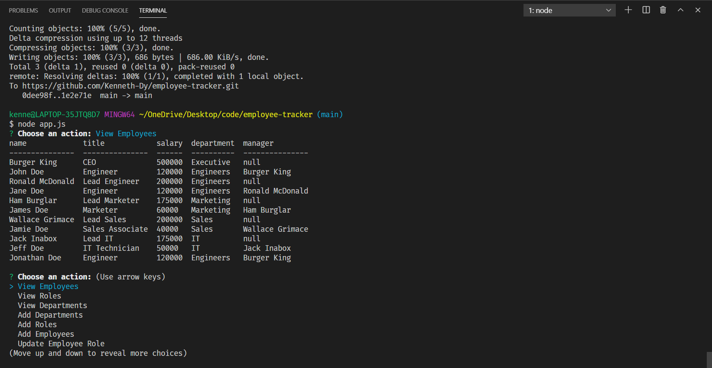

# Employee Tracker

Use this project to input your employees, departments, and positions into a sql database. For departments you can input their names. For positions you can ipnut the title, salary and what department they belong too. For employees you can input their first and last name, role, and whether they have a manager or not. You can also view the list of employees, departments, and roles of the company. You can also update and employee's role. This is a CLI program so to siply run it you need to use node in your preferred terminal. There is seed data as well if you wish to try it out with data already filled in. 

[Check out the demo video](https://drive.google.com/file/d/16gx1Hup1jG5wFN4ieiSx5PVaRO2Elqvk/view)